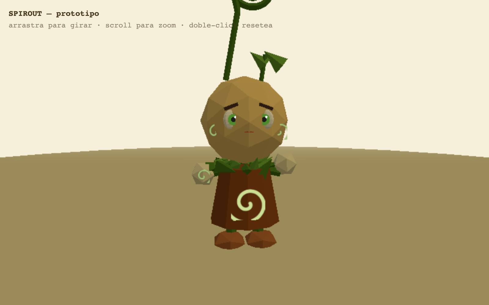
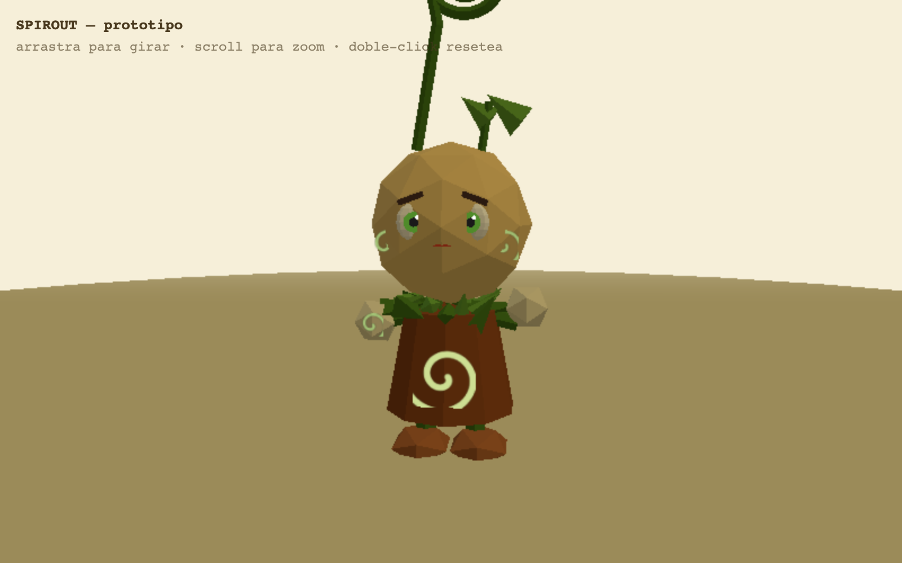
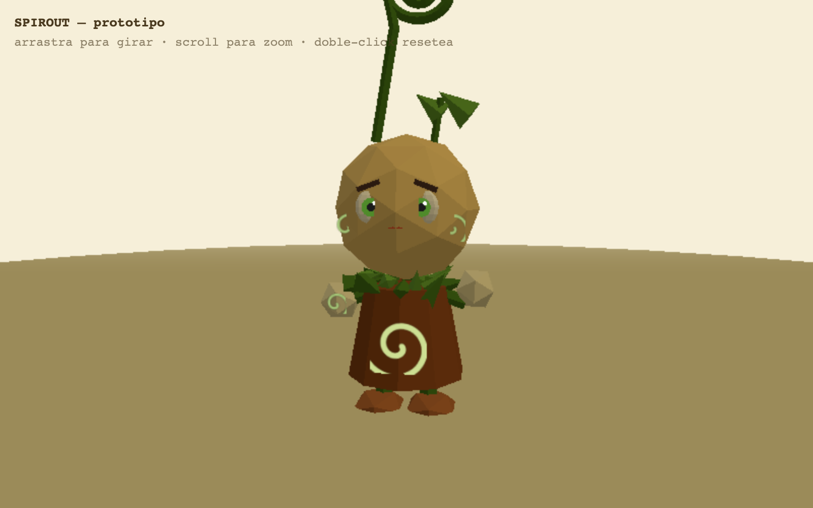

<div align="center">
  
</div>

# 🧚 Spirout

**Un duende del bosque de cabeza amarilla y antena en espiral, esculpido a base de primitivas con estética Nintendo 64.**

[](https://gavilanbe.github.io/spirout/)


---

## Qué es esto

El prototipo 3D del protagonista de *Spirout*: un pequeño duende del bosque con la cabeza amarilla, una antena en espiral y un collar de hojas, modelado al 100% de forma procedural con primitivas de Three.js (~350 polígonos) y estética **Nintendo 64**.

El personaje tiene una animación idle: respira con un rebote suave, gira lentamente y mueve los brazos. Todo en una paleta cálida de bosque, con la cabeza facetada para reforzar el look low-poly retro.

## 🎮 Cómo se juega

No hay objetivo: es un visor 3D para dar vueltas alrededor del personaje y verlo desde todos los ángulos.

| Acción | Control |
|---|---|
| Girar la cámara | Arrastrar con el ratón |
| Zoom | Rueda del ratón |
| Resetear la cámara | Doble clic |

## 📸 Capturas

| | |
|---|---|
|  |  |

## ▶️ Jugar

Juégalo directamente en el navegador: **[gavilanbe.github.io/spirout](https://gavilanbe.github.io/spirout/)**

O en local, sin instalar nada:

```bash
python3 -m http.server 8000
# luego abre http://localhost:8000
```

## 🛠️ Bajo el capó

- **Three.js r160** vía CDN (import map), sin build ni dependencias instaladas.
- `OrbitControls` para la cámara orbital con damping.
- Antena espiral generada con `TubeGeometry` sobre una curva Catmull-Rom.
- Collar de hojas con 16 conos dispuestos en doble anillo.
- Cabeza con `IcosahedronGeometry` para el facetado low-poly.
- Detalles dibujados con texturas de canvas (espirales en mejillas, panza y mano) y `NearestFilter`.
- `MeshLambertMaterial` con `flatShading` y luces cálida + relleno frío.

## 📦 Créditos

Publicado por [@gavilanbe](https://github.com/gavilanbe). Uno más de mi colección de juegos hechos por hobby. 🎮

## 📄 Licencia

[MIT](LICENSE)
